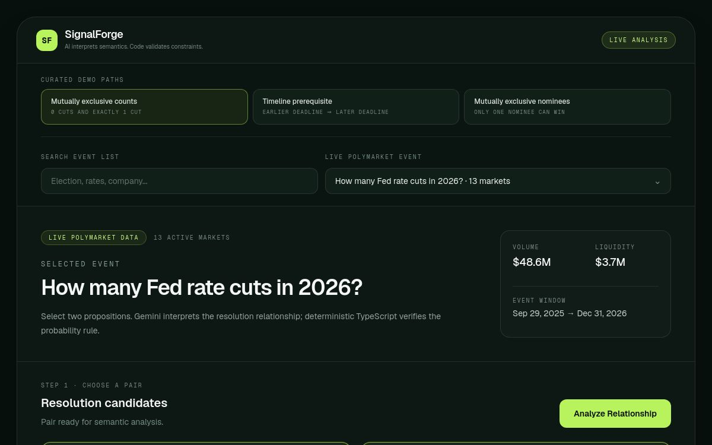
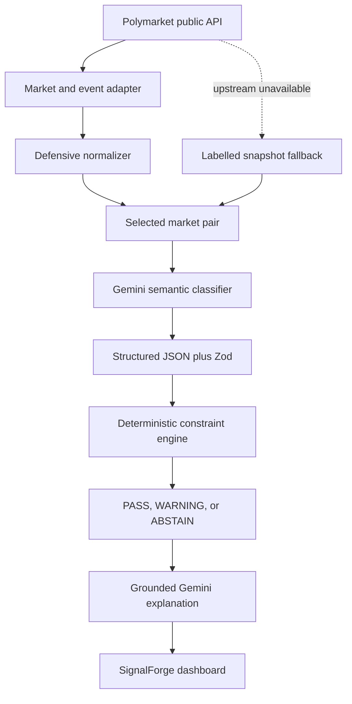

# SignalForge

> **AI understands the relationship. Mathematics verifies the probability.**

## Overview

SignalForge is an AI-powered logical consistency engine for prediction markets. It discovers related public Polymarket markets, uses Gemini to interpret their full resolution conditions, and applies deterministic TypeScript rules to verify the corresponding probability constraint.

[Open the live application](https://signalforge-impact-forge.taka0101ty.chatgpt.site)



SignalForge is an analytical research tool. It is not a betting app, trading bot, wallet, order-execution client, arbitrage executor, or source of financial advice.

## Problem

Prediction markets show individual probabilities, but related propositions can imply logical constraints that are difficult to monitor manually. A title-only comparison is unsafe: different deadlines, sources, and resolution wording can make apparently related questions incomparable.

## Solution

SignalForge uses AI for semantic relationship classification and deterministic code for probability verification:

1. **Semantic interpretation:** an LLM examines both questions, descriptions, sources, dates, and event context.
2. **Mathematical verification:** pure TypeScript applies the probability rule selected by the validated semantic result.

**The LLM never decides whether the probability constraint passes or fails.**

## Demo

The deployed dashboard includes three curated, real-market paths:

| Scenario | Relationship under review | Suggested pair |
| --- | --- | --- |
| **Primary: mutually exclusive counts** | Exact outcomes cannot both occur | 0 Fed cuts vs exactly 1 Fed cut in 2026 |
| **Backup: timeline prerequisite** | Earlier deadline implies later deadline | Putin out by Aug 31 vs Sep 30, 2026 |
| Mutually exclusive nominees | Only one candidate can win | Kamala Harris vs Gavin Newsom for 2028 Democratic nominee |

Each curated path attempts a fresh public API request first. If Polymarket is unavailable, the app uses an explicitly labelled snapshot captured on **2026-08-14 UTC**. It never presents snapshot values as live data. See [the demo scenarios](docs/DEMO_SCENARIOS.md) and [the three-minute demo script](docs/DEMO_SCRIPT.md).

The final public video URL will be added to this section before hackathon submission.

Verified production response shape (live values change):

```json
{
  "model": "gemini-3.6-flash",
  "dataSource": "live",
  "relationship": {
    "relationship": "mutually_exclusive",
    "confidence": 0.95,
    "abstain": false
  },
  "constraint": {
    "status": "pass",
    "expectedConstraint": "P(A) + P(B) ≤ 1",
    "gap": -0.0525
  },
  "explanationSource": "gemini"
}
```

## Architecture



All Gemini requests run in server-side route handlers. `GEMINI_API_KEY` is never sent to the browser. The client receives a deliberately small projection of market data; full descriptions stay server-side for analysis.

See [the technical overview](docs/TECHNICAL_OVERVIEW.md) for module boundaries, trust boundaries, and request flow.

## Snapshot fallback

Curated scenarios fetch live data first. If Polymarket times out or fails, the server supplies a source-controlled normalized snapshot for that exact event. The dashboard switches to a **Polymarket snapshot** badge, shows the capture date, and labels the state as a degraded demo. Snapshot data is never presented as live.

## AI pipeline

The classifier receives the complete market evidence:

- question and description;
- resolution source;
- start and end dates;
- event title, description, source, and time window.

It must return strict structured JSON with a relationship, direction, comparable-scope decision, confidence, abstention flag, and reason. Zod rejects malformed output. SignalForge then enforces its configured confidence threshold and scope checks before code applies any probability rule.

A second Gemini call writes a short explanation from the already-locked deterministic result. If this optional prose pass fails, SignalForge returns a deterministic fallback explanation without changing the result.

Allowed relationship types are `prerequisite`, `subset`, `mutually_exclusive`, `equivalent`, `exhaustive_pair`, `correlated_only`, `independent`, and `unknown`.

## Deterministic engine

The engine in `src/lib/logic/` is independent of the model and exposes pure functions.

| Relationship | Applied constraint |
| --- | --- |
| A requires B / A is a subset of B | `P(A) <= P(B)` |
| Mutually exclusive | `P(A) + P(B) <= 1` |
| Equivalent | `abs(P(A) - P(B)) <= tolerance` |
| Exhaustive binary pair | `abs(P(A) + P(B) - 1) <= tolerance` |

The structured result contains `status`, `rule`, `expectedConstraint`, observed values, gap, and explanation data. Unsupported, ambiguous, low-confidence, or mismatched-scope classifications return `ABSTAIN`.

## Tech stack

- Next.js App Router, React, TypeScript, and Tailwind CSS
- Zod for runtime validation
- OpenAI-compatible Node SDK for the Gemini Developer API
- Vitest for unit tests
- Public Polymarket Gamma API for market data
- Sites production hosting with a Vercel-compatible `next build`

No database, authentication, payment, wallet, or trading infrastructure is used.

## Project structure

```text
app/api/analyze/          server-only analysis orchestration
app/api/events/           normalized event endpoint
src/lib/ai/               Gemini client, prompts, schemas
src/lib/polymarket/       API client, defensive normalization
src/lib/logic/            pure probability constraint engine
src/lib/demo/             curated live paths and labelled snapshots
src/components/           dashboard workflow
tests/                    logic, schema, adapter, demo, render tests
```

## Setup

Prerequisites: Node.js 22.13 or newer and a Gemini API key from Google AI Studio.

```bash
git clone https://github.com/Takzin1/SignalForge.git
cd SignalForge
npm ci
cp .env.example .env.local
npm run dev
```

Add `GEMINI_API_KEY` to `.env.local`, then open the local URL printed by the development server. Polymarket market-data requests require no wallet and no API key.

## Environment variables

| Variable | Required | Default | Purpose |
| --- | --- | --- | --- |
| `GEMINI_API_KEY` | Yes for AI analysis | — | Server-only Gemini credential |
| `GEMINI_MODEL` | No | `gemini-3.6-flash` | Gemini model ID; the default has a free tier |
| `SIGNALFORGE_CONFIDENCE_THRESHOLD` | No | `0.75` | Minimum confidence before abstaining |
| `SIGNALFORGE_PROBABILITY_TOLERANCE` | No | `0.03` | Probability-rule tolerance |

Never expose `GEMINI_API_KEY` through a `NEXT_PUBLIC_` variable or commit `.env.local`.

## Error handling

| Failure | Behavior |
| --- | --- |
| Polymarket timeout or error | Preserve the dashboard; curated paths fall back to labelled snapshots |
| Gemini invalid credential / 401 / 403 | Friendly non-retryable configuration error |
| Gemini 429 / 5xx / timeout | One bounded SDK retry, then a retryable UI error |
| Invalid JSON or schema mismatch | Reject the classification; do not run the math engine |
| Low confidence or incompatible scope | Return `ABSTAIN` |
| Explanation call failure | Keep the locked verdict and use deterministic prose |

External failures never produce fabricated classifications or successful-looking live data.

## Testing

```bash
npm test
npm run lint
npm run build
npm run vercel-build
npm run test:rendered
npm audit --omit=dev --audit-level=high
```

The current suite covers all four deterministic rules, pass/warning/abstain behavior, invalid inputs, model JSON/schema handling, route-level 401/429/5xx/timeout mapping, explanation fallback, defensive Polymarket normalization, curated snapshot integrity, and rendered output. A live Polymarket integration test is opt-in:

```bash
RUN_LIVE_TESTS=1 npm test -- tests/polymarket.live.integration.test.ts
```

GitHub Actions runs tests, lint, and the Vercel-compatible build on pushes and pull requests.

## Limitations

- Semantic classifications can be wrong or incomplete; confidence is evidence, not certainty.
- Similar wording does not guarantee matching resolution scope.
- Public probabilities can change between fetch, display, and analysis.
- Pairwise constraints do not prove global consistency across an event.
- Snapshot mode demonstrates reliability but is not current market data.
- Warnings are analytical inconsistencies, not arbitrage or trading signals.

## Disclaimer

SignalForge provides analytical signals for research and education. It does not execute trades and does not provide financial advice.

## Data and API citations

- [Polymarket: Discover Markets](https://docs.polymarket.com/market-data/discover-markets) — Gamma event discovery and event-by-slug guidance
- [Polymarket API changelog](https://docs.polymarket.com/changelog/predictions) — current keyset pagination direction
- [Gemini OpenAI compatibility](https://ai.google.dev/gemini-api/docs/openai) — official Node SDK endpoint and structured-output pattern
- [Gemini API pricing](https://ai.google.dev/gemini-api/docs/pricing) — free-tier availability for the default model
- [Gemini API keys](https://ai.google.dev/gemini-api/docs/api-key) — key creation and server-side credential guidance
- [OpenAI Node SDK](https://github.com/openai/openai-node) — compatible server-side client
- [Zod](https://zod.dev/) — runtime schema validation
- [Next.js](https://nextjs.org/docs/app) and [Vitest](https://vitest.dev/) — application and test frameworks

Market questions, resolution descriptions, probabilities, liquidity, and volume are attributed to the public Polymarket Gamma API. Curated snapshots record the retrieval date in the UI and source.

## Hackathon disclosure

**Core development was completed during Impact Forge Summer 2026.**

SignalForge was built as a solo hackathon project. Open-source libraries, frameworks, and public APIs are identified above and in `package.json`. No prebuilt proprietary SignalForge codebase was used.

## License

[MIT](LICENSE)
