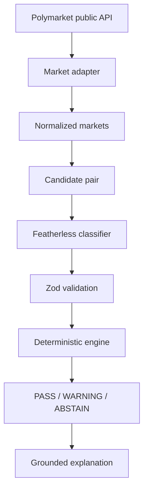

# SignalForge

> **AI interprets semantics. Code validates probability constraints.**

SignalForge is an AI-powered logical consistency engine for prediction markets. It discovers related public Polymarket markets, uses Featherless to interpret whether their resolution conditions imply a formal relationship, and applies deterministic TypeScript rules to verify the corresponding probability constraint.

SignalForge is an analytical research tool. It is not a betting app, trading bot, wallet, order-execution client, or source of financial advice.

## Status

Stage A foundation is complete. Live market discovery, deterministic rules, and Featherless inference will be implemented as isolated vertical slices before product polish.

## Problem

Prediction markets expose individual probabilities, but related propositions can imply constraints that are difficult to monitor manually at scale. Correct analysis requires both semantic interpretation of resolution conditions and exact mathematical verification.

## Why consistency checking matters

Market titles alone are insufficient. Different time windows, resolution sources, or event scopes can make apparently related questions incomparable. SignalForge is designed to abstain when those conditions are ambiguous.

## Demo

The deployed application and sub-three-minute demo video will be linked here before submission.

## Architecture



## AI pipeline

Featherless receives the full question, description, resolution source, time window, and event context. Its structured output is validated with Zod. Low-confidence or ambiguous classifications must abstain. The model never decides the mathematical verdict.

## Deterministic engine

Pure TypeScript functions will validate prerequisite/subset, mutual-exclusion, equivalence, and exhaustive-pair constraints with configurable tolerances. Unit tests are a release gate.

## Tech stack

- Next.js App Router, React, TypeScript, and Tailwind CSS
- Zod for runtime validation
- OpenAI-compatible SDK for Featherless.ai
- Vitest for unit tests
- Public Polymarket Gamma API for market data

No database, authentication, payment, wallet, or trading infrastructure is used in the MVP.

## Setup

Prerequisites: Node.js 22.13 or newer.

```bash
git clone <public-repository-url>
cd signalforge
npm ci
cp .env.example .env.local
npm run dev
```

Open the local URL printed by the development server.

## Environment variables

| Variable | Required | Default | Purpose |
| --- | --- | --- | --- |
| `FEATHERLESS_API_KEY` | Yes for AI analysis | — | Server-only Featherless credential |
| `FEATHERLESS_MODEL` | No | `zai-org/GLM-5.2` | OpenAI-compatible model ID |
| `SIGNALFORGE_CONFIDENCE_THRESHOLD` | No | `0.75` | Minimum confidence before abstaining |
| `SIGNALFORGE_PROBABILITY_TOLERANCE` | No | `0.03` | Default probability-rule tolerance |

Never expose `FEATHERLESS_API_KEY` through a `NEXT_PUBLIC_` variable or commit `.env.local`.

## Error handling

The completed vertical slice will include timeouts, one bounded retry where appropriate, explicit handling for upstream authentication/rate-limit/server errors, malformed model output, Zod failures, and recoverable UI states.

## Testing

```bash
npm test
npm run lint
npm run build
```

## Limitations

- Semantic classifications can be wrong or incomplete.
- Similar wording does not guarantee matching resolution scope.
- Public market prices can change between fetch and display.
- Warnings are analytical inconsistencies, not arbitrage claims.

## Disclaimer

SignalForge provides analytical signals for research and education. It does not execute trades and does not provide financial advice.

## Data and API citations

- [Polymarket Gamma API](https://docs.polymarket.com/developers/gamma-markets-api/overview)
- [Featherless.ai documentation](https://featherless.ai/docs)
- [OpenAI Node SDK](https://github.com/openai/openai-node)

## Hackathon disclosure

Core development was completed during Impact Forge Summer 2026. Open-source frameworks, libraries, and public APIs are identified above and in `package.json`.

## License

License selection will be finalized before the public submission repository is opened.
