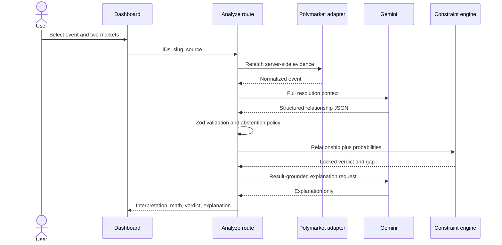

# SignalForge technical overview

## Design invariant

**AI interprets semantics. Code validates probability constraints.**

SignalForge uses a language model only where natural-language interpretation is necessary. It treats every model response as untrusted input, validates it at runtime, and delegates the numerical verdict to a small deterministic engine.

## Request flow



The route refetches selected live markets server-side rather than trusting probabilities from the browser. Snapshot requests resolve only against a fixed allowlist of three curated Polymarket captures.

## Module boundaries

| Module | Responsibility | Explicitly does not do |
| --- | --- | --- |
| `src/lib/polymarket/` | Fetch, time out, parse, normalize, and project public market data | Authentication, wallet access, order placement |
| `src/lib/ai/` | Construct grounded prompts, call Gemini, validate strict JSON, map errors | Decide probability verdicts |
| `src/lib/logic/` | Apply pure probability rules and safety gates | Call APIs or parse natural language |
| `src/lib/demo/` | Define curated slugs, preferred pairs, and labelled captures | Pretend captures are live |
| `app/api/analyze/` | Orchestrate the end-to-end server workflow | Expose API keys |
| `src/components/` | Preserve selection state and render the one-page workflow | Depend on raw Gamma response shapes |

## Semantic contract

The classifier emits:

```json
{
  "relationship": "prerequisite | subset | mutually_exclusive | equivalent | exhaustive_pair | correlated_only | independent | unknown",
  "direction": "A_requires_B | B_requires_A | symmetric | none",
  "same_resolution_scope": true,
  "confidence": 0.91,
  "abstain": false,
  "reason": "Grounded explanation of the resolution relationship."
}
```

Zod uses a strict object schema. After validation, application code overrides unsafe certainty: confidence below the configured threshold, incomparable resolution scope, or unsupported relationships force `ABSTAIN`.

## Deterministic rules

Let `pA` and `pB` be the normalized Yes probabilities.

- Prerequisite/subset, A requires B: warning when `pA - pB > tolerance`.
- Prerequisite/subset, B requires A: warning when `pB - pA > tolerance`.
- Mutually exclusive: warning when `pA + pB - 1 > tolerance`.
- Equivalent: warning when `abs(pA - pB) > tolerance`.
- Exhaustive pair: warning when `abs(pA + pB - 1) > tolerance`.

Invalid probabilities, ambiguous direction, low confidence, scope mismatch, classifier abstention, correlation-only, independence, and unknown relations all abstain.

## Trust and failure boundaries

| Boundary | Control |
| --- | --- |
| Browser → API | Strict request schema; selected IDs must differ |
| Gamma API → adapter | Defensive Zod envelope parsing; malformed markets are dropped |
| Model → application | JSON Schema-constrained response and strict Zod validation |
| Semantic result → math | Confidence, scope, direction, and relationship gates |
| Verdict → explanation model | Immutable computed result supplied in the prompt; response schema contains prose only |
| Credential → browser | Key read only through server environment variables |

Polymarket requests use an eight-second abort timeout. The OpenAI-compatible Gemini client is configured for one bounded retry and maps invalid credentials, 429, 5xx, timeouts, and invalid schemas to user-safe responses.

## Runtime and deployment

- Dynamic Next.js App Router page for current public event data
- Server route handlers for event fetches and analysis
- In-memory/framework HTTP caching only; no database
- Sites production deployment
- `next build` maintained as a Vercel-compatible release gate

## Test strategy

The suite prioritizes the most damaging failure modes:

1. false mathematical verdicts;
2. malformed or overconfident model output;
3. malformed/stringified Gamma API fields;
4. broken curated fallback data;
5. application render regressions.

The live Gamma integration test is opt-in so CI remains deterministic. Gemini success-path verification requires a real server-side key and is intentionally never faked.
